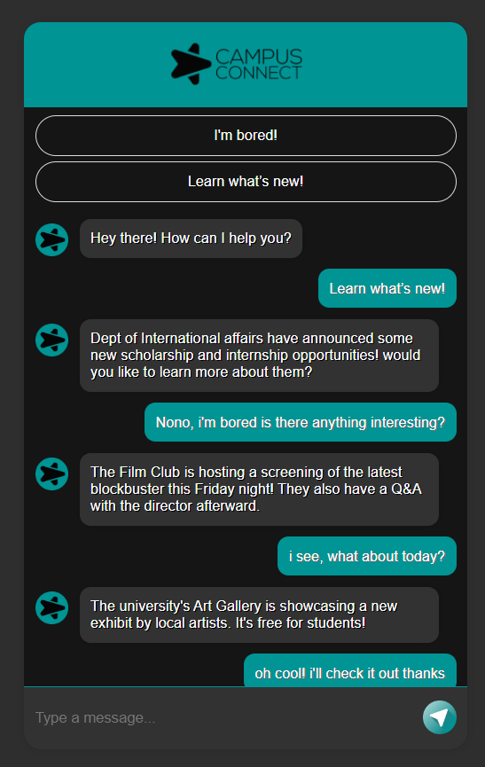

# Campus-Connect

## Your AI-Powered Campus Buddy. Enhance Your Campus Experience with a Smart Assistant


**Campus Connect** is your one-stop shop for a fulfilling and enriching college life. This innovative AI-powered chat assistant is here to help you make the most of your campus experience, whether you're seeking entertainment, exploring events, or navigating the complexities of internships and scholarships.

**Features:**

* **Interactive Chat Interface:** Engage in natural conversations with the AI assistant in real-time. Get personalized suggestions and answers to your unique questions.
* **Event Recommendations:** Discover exciting happenings on campus tailored specifically to your interests. Never miss out on the fun!
* **Internship & Scholarship Assistance:** Gain access to detailed information and valuable guidance on available internship and scholarship opportunities. Make informed decisions about your future.
* **Conversational AI Powered by Google's Gemini:** Experience smooth and intuitive interactions with human-like responses generated by Google's cutting-edge Gemini model.
* **Sample Questions:** Leverage a curated list of common topics with one-click access to sample questions. Simplify your interaction with the assistant.
* **Dynamic Responses:** The assistant continuously learns from your chat history, enabling it to provide more contextually relevant and helpful responses over time.

<center>

</center>

## Technologies Used:

* **Backend:** Flask (a lightweight and flexible web framework) efficiently handles requests and responses.
* **Frontend:** HTML, CSS, and JavaScript work together seamlessly to create a visually appealing and user-friendly interface.
* **AI Integration:** Google's powerful Gemini model is the heart of the chat assistant, allowing it to generate natural and engaging conversational responses.
* **Data Storage:** JSON files provide a structured way to maintain a comprehensive knowledge base of questions and answers.

## Setting Up Campus Connect

## Setup Instructions

1. **Clone the repository**:
    ```bash
    git clone https://github.com/Ahad-Malik/campus-connect.git
    cd campus-connect
    ```

2. **Install dependencies**:
    ```bash
    pip install -r requirements.txt
    ```

3. **Run the Flask app**:
    ```bash
    export FLASK_APP=app.py
    flask run
    ```

4. **Access the application**:
    Open your browser and navigate to `http://127.0.0.1:5000/`.

## Folder Structure

- **app.py**: Main application file containing Flask routes and logic.
- **templates/**: Contains HTML templates for the application. Javascript code is inside the html file.
- **static/**: Contains static files such as CSS and images.
- **knowledge_base.json**: JSON file storing predefined questions and answers.
- **prompts.py**: File containing prompts used by the AI for generating responses.
